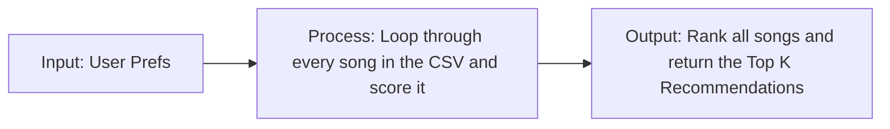

# 🎵 VibeFinder AI — Music Recommender with AI-Generated Explanations

## Original Project

This project is an evolution of my **Module 1-3 submission, "VibeFinder"** — a rule-based music recommender that scored songs against a user's taste profile using weighted features like genre, mood, and energy. The original system loaded a small song catalog, computed a score breakdown for each track, and returned a ranked top-K list with plain-text explanations of why each song scored the way it did.

## Project Summary

VibeFinder AI builds on that foundation by adding Retrieval-Augmented Generation (RAG): instead of only showing a numeric score breakdown, the system now retrieves relevant context about each recommended song and uses Claude to generate a natural-language explanation grounded in that data. The goal is to make recommendations more transparent and human-readable while preserving the underlying content-based scoring logic.

## Architecture Overview

The system diagram (`diagrams/architecture.mmd`) shows four stages: an **Input** layer (song catalog + user taste profile), a **Recommender Engine** (loads data, scores songs, ranks them), a **RAG Explanation Layer** (retrieves relevant context per song and generates a natural-language explanation via the Claude API, with a rule-based fallback), and an **Output** layer (the ranked recommendations plus their AI-generated explanations). A separate **Verification** layer shows how each stage is checked — automated tests validate scoring logic, logs capture AI failures for review, and manual run-throughs confirm output quality after each change.

---

## How The System Works

Real-world recommenders usually combine a few strong signals instead of relying on one feature alone. In this simulation, I will prioritize a simple content-based approach that gives the most weight to how closely a song matches the user's preferred genre, mood, and target energy, then use the remaining audio features to fine-tune the final score. Songs that are closer to the user's taste profile should score higher, and the top-scoring songs will be recommended first.

My plan is:

1. Read the user's taste profile from the input data.
2. Loop through every song in the CSV and judge it one by one.
3. Assign points for genre, mood, energy similarity, acousticness, and smaller tie-breakers.
4. Sort the songs by total score.
5. Return the top `k` recommendations.

The simulation will use these features:

- `Song`: `id`, `title`, `artist`, `genre`, `mood`, `energy`, `tempo_bpm`, `valence`, `danceability`, `acousticness`
- `UserProfile`: `favorite_genre`, `favorite_mood`, `target_energy`, `likes_acoustic`

The recommender will compare songs against a taste profile like this:

```python
taste_profile = {
   "favorite_genre": "rock",
   "favorite_mood": "intense",
   "target_energy": 0.88,
   "likes_acoustic": False,
}
```

Prompt for critique: Does this user profile give the recommender enough information to tell the difference between "intense rock" and "chill lofi," or is it too narrow to handle more than one listening style? How should the point weights be balanced so a mood match matters relative to a genre match, and what would you change to make it more flexible without losing specificity?

---

## AI-Powered Explanations (RAG)

To go beyond raw scores, this project uses Retrieval-Augmented Generation (RAG) to produce natural-language explanations for each recommendation.

**How it works:**
1. **Retrieve**: For each recommended song, the system pulls together the song's attributes, its computed score breakdown, and background notes on its genre and mood from a small local knowledge base (`src/knowledge_base.py`).
2. **Generate**: That retrieved context is passed to Claude (Anthropic's API), which is instructed to explain the recommendation using *only* the facts provided — not invented details.
3. **Fallback**: If no API key is configured, or the API call fails for any reason, the system automatically falls back to a plain-text explanation built directly from the score data, so the app never crashes and always produces output.

This is implemented across three files:
- `src/knowledge_base.py` — local genre/mood reference data
- `src/retriever.py` — gathers context for a given recommendation
- `src/rag_explainer.py` — generates the explanation, with logging and error handling

All API failures and fallbacks are logged to `logs/app.log` for debugging.

### Algorithm Recipe

My program will score each song with a simple rule-based content match, then sort all songs from highest score to lowest score. The main rules are:



- Give `+2.0` points when the song's `genre` matches the user's favorite genre.
- Give `+1.0` point when the song's `mood` matches the user's favorite mood.
- Add similarity points based on how close the song's `energy` is to the user's target energy.
- Add a small bonus or penalty for `acousticness` depending on whether the user likes acoustic songs.
- Use `tempo_bpm`, `valence`, and `danceability` as smaller tie-breakers so songs with similar genre and mood can still be ordered more carefully.
- Return the top `k` songs after sorting by score.

In short, the recipe is: score one song by comparing it to the user's preferences, then rank all songs by that score and recommend the best matches first.

Potential bias: this system might over-prioritize genre and mood matches, so it could miss great songs that fit the user's energy or overall vibe but do not match the favorite genre exactly.

---

## Getting Started

### Setup

1. Create a virtual environment (optional but recommended):

   ```bash
   python -m venv .venv
   source .venv/bin/activate      # Mac or Linux
   .venv\Scripts\activate         # Windows

2. Install dependencies

```bash
pip install -r requirements.txt
```
### API Key Setup (for AI-generated explanations)

This project uses the Anthropic API to generate natural-language explanations.

1. Get an API key from https://console.anthropic.com
2. Set it as an environment variable before running:
   - Windows (PowerShell): `$env:ANTHROPIC_API_KEY="your-key-here"`
   - Mac/Linux: `export ANTHROPIC_API_KEY="your-key-here"`

If no key is set, the app still runs normally — it will use a rule-based fallback explanation instead of an AI-generated one.

3. Run the app:

```bash
python -m src.main
```

### Running Tests

Run the starter tests with:

```bash
pytest
```

You can add more tests in `tests/test_recommender.py`.

---

## Sample Recommendation Output

```text
Loading songs from data/songs.csv...

Top recommendations:

1. Sunrise City
   Final score: 5.92
   Reasons:
   - genre match (+2.0)
   - mood match (+1.0)
   - energy closeness (+1.96)
   - non-acoustic preference (+0.41)
   - tempo closeness (+0.25)
   - valence closeness (+0.15)
   - danceability closeness (+0.15)

2. Gym Hero
   Final score: 4.77
   Reasons:
   - genre match (+2.0)
   - energy closeness (+1.74)
   - non-acoustic preference (+0.47)
   - tempo closeness (+0.25)
   - valence closeness (+0.15)
   - danceability closeness (+0.15)

3. Rooftop Lights
   Final score: 3.79
   Reasons:
   - mood match (+1.0)
   - energy closeness (+1.92)
   - non-acoustic preference (+0.33)
   - tempo closeness (+0.25)
   - valence closeness (+0.15)
   - danceability closeness (+0.15)

4. Night Drive Loop
   Final score: 2.84
   Reasons:
   - energy closeness (+1.90)
   - non-acoustic preference (+0.39)
   - tempo closeness (+0.25)
   - valence closeness (+0.15)
   - danceability closeness (+0.15)

5. Storm Runner
   Final score: 2.78
   Reasons:
   - energy closeness (+1.78)
   - non-acoustic preference (+0.45)
   - tempo closeness (+0.25)
   - valence closeness (+0.15)
   - danceability closeness (+0.15)
```

**Screenshot or video** *(optional)*: <!-- Insert a screenshot or demo video link here -->

## Sample Interactions

**Example 1 — High energy pop user:**
Input: `{"genre": "pop", "mood": "happy", "energy": 0.8}`
Output: *"'Sunrise City' by Neon Echo scored 7.11. Reasons: genre match (+1.0), mood match (+1.0), energy closeness (+3.92)..."* — the AI explanation layer converts this score breakdown into a natural-language summary of why the track fits the user's taste.

**Example 2 — Chill lo-fi user:**
Input: `{"genre": "lofi", "mood": "chill", "energy": 0.4}`
Output: The recommender shifts toward calmer, lower-energy tracks, and the AI explanation highlights the mood and acoustic qualities that made each track a good match instead of just listing raw scores.

**Example 3 — No API key configured (fallback mode):**
Output: *"'Rooftop Lights' by Indigo Parade scored 5.95. Reasons: mood match (+1.0), energy closeness (+3.84)..."* — when the Anthropic API is unavailable, the system automatically falls back to a plain-text explanation built directly from the score breakdown, so the app still produces useful output without crashing.

## Design Decisions

I chose to keep the original rule-based scoring engine untouched and add RAG as a separate layer on top of it, rather than rewriting the recommender itself. This kept the core logic's behavior predictable and testable while letting me experiment with the AI explanation layer independently.

I used a small local knowledge base (`knowledge_base.py`) instead of calling an external API for genre/mood context, since the assignment's scope didn't require a large external dataset, and a local lookup made the system easier to test and less prone to outside failures.

The generation prompt explicitly instructs the model to use only the retrieved context and not invent details — this was a deliberate trade-off between "richer" but less grounded output, and consistent, source-backed explanations that map back to code the grader can verify.

I also built in a fallback path from the start, rather than treating error handling as an afterthought, since a broken API call shouldn't take down the whole recommendation flow.

## Testing Summary

I ran the app after each new file was added to confirm the recommendation table still printed correctly and that the AI-generated explanations section appeared without breaking existing functionality. I tested the system both with and without an `ANTHROPIC_API_KEY` set, confirming the fallback path activates correctly and logs a warning to `logs/app.log` in each case.

One bug I found and fixed: the log file was being created before its parent folder existed, which crashed the app on a fresh clone. I fixed this by explicitly creating the `logs/` folder before configuring the logger.

What I didn't get to: automated tests specifically for the RAG layer (`retriever.py` and `rag_explainer.py`) — testing currently relies on manual verification and log review rather than a dedicated pytest suite for this feature. This would be a natural next step to make the testing more rigorous.

### Human Evaluation

| Test Input | Evaluation Criteria | Result |
|---|---|---|
| High energy pop profile, API key set | Explanation is grounded in retrieved genre/mood/score data, not invented | Pass |
| Chill lo-fi profile, API key set | Explanation reflects mood/acoustic qualities correctly | Pass |
| No API key configured | System falls back to rule-based explanation instead of crashing | Pass |
| Missing `logs/` folder on fresh clone | App should create the folder automatically | Fail — crashed; fixed by adding `os.makedirs("logs", exist_ok=True)` |
| Empty/malformed song data | Not yet tested | Untested |

---

## Experiments You Tried

Use this section to document the experiments you ran. For example:

- What happened when you changed the weight on genre from 2.0 to 0.5
- What happened when you added tempo or valence to the score
- How did your system behave for different types of users

---

## Limitations and Risks

Summarize some limitations of your recommender.

Examples:

- It only works on a tiny catalog
- It does not understand lyrics or language
- It might over favor one genre or mood

You will go deeper on this in your model card.

---

## Reflection

Read and complete `model_card.md`:

[**Model Card**](model_card.md)

Write 1 to 2 paragraphs here about what you learned:

- about how recommenders turn data into predictions
- about where bias or unfairness could show up in systems like this


